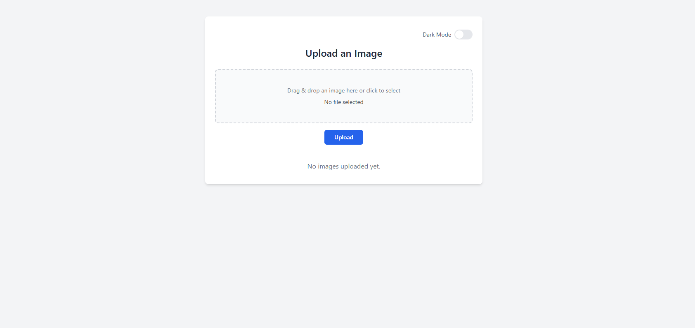
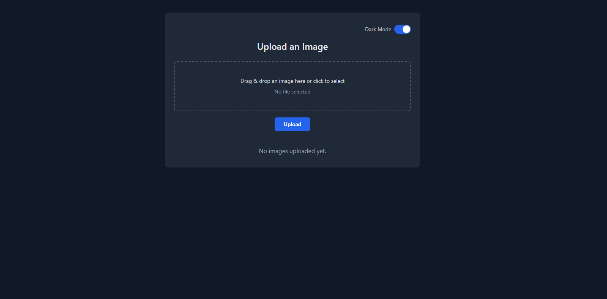
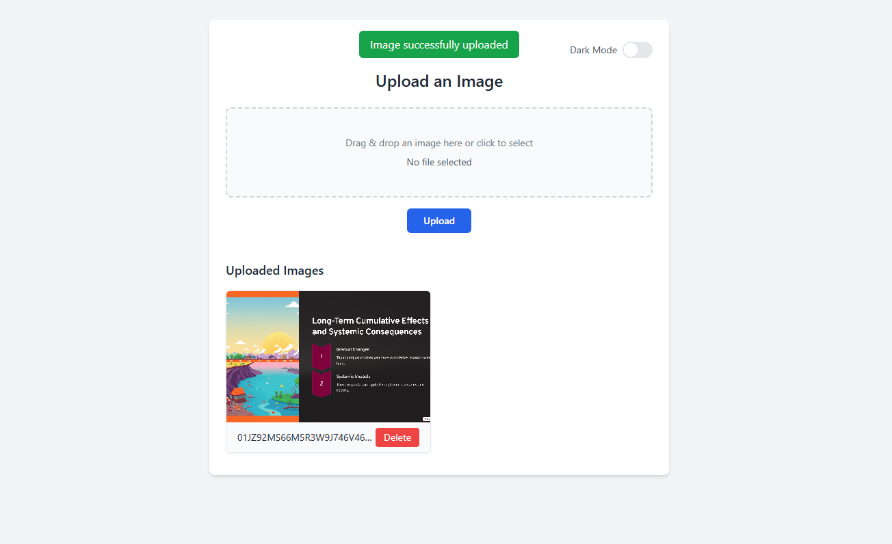

# 🌐 Image Uploader Web App (Serverless on AWS)

A simple image uploader web application built with **Node.js**, **Express**, and **EJS**, deployed to **AWS Lambda** via **API Gateway**, using **Terraform** for infrastructure-as-code.

Uploaded images are stored in an **Amazon S3** bucket and publicly viewable. Optional WAF IP allowlisting is included for security.

---

## 🚀 Features

- Upload images via a responsive frontend (TailwindCSS)
- Store and serve images from AWS S3
- Serverless deployment via AWS Lambda and API Gateway
- Delete images with a single click
- Infrastructure managed with Terraform
- Optional IP allowlisting via AWS WAF
- Dark Mode Toggle

---
## ⚙️ Prerequisites

- Node.js (v18+)
- AWS CLI configured (`aws configure`)
- Terraform (v1.3+)
- An AWS account with access to:
  - Lambda
  - S3
  - API Gateway
  - IAM
  - WAF (optional)

---

## 🧑‍💻 Local Development

```bash
# 1. Install dependencies
npm ci --omit=dev

# 2. Run locally (optional)
node app.js
```

## ☁️ Deploy to AWS

### 1. Configure Terraform Variables

Edit or create `iac/terraform.tfvars`:

```hcl
region               = "us-east-1"
lambda_function_name = "image-uploader"
lambda_timeout       = 10
lambda_memory_size   = 128
ip_allowlist         = ["YOUR_IP_ADDRESS/32"]
```
### 2. Initialize Terraform
```bash
cd iac/
terraform init
terraform apply
```
Terraform will:

- Install Node.js dependencies

- Zip your project (excluding Terraform files)

- Create S3 bucket, Lambda function, API Gateway, WAF

- Deploy the backend and return the API Gateway endpoint

## 🌍 Usage

### Uploading Images

- Visit the API Gateway URL [link](https://b0ixlzmenh.execute-api.eu-central-1.amazonaws.com/prod) to:
  - Upload images via file picker or drag & drop
  - View and delete uploaded images
  - Toggle between light and dark modes for better accessibility

### S3 Bucket
Uploaded files are stored at:
```bash
https://<bucket-name>.s3.amazonaws.com/<file-name>
```

## 🧹 Cleanup
To delete all resources:
```bash
terraform destroy
```
## 🖼️ Screenshots

### 🔆 Light Mode


### 🌙 Dark Mode


### 📤 After Uploading an Image

